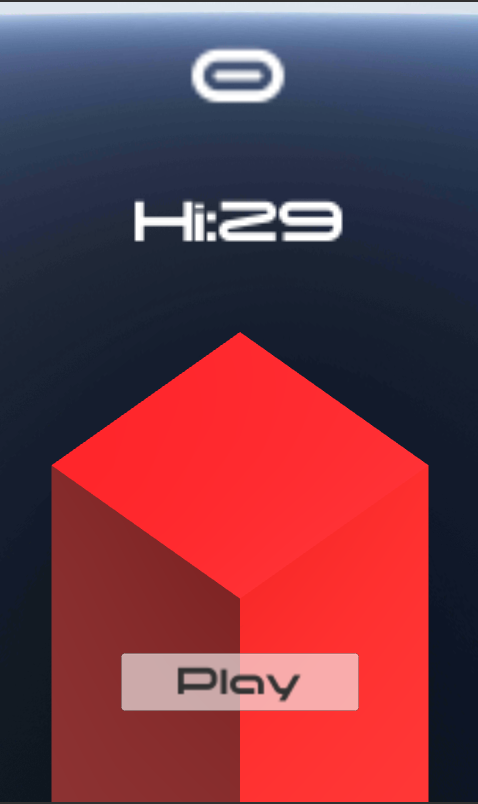
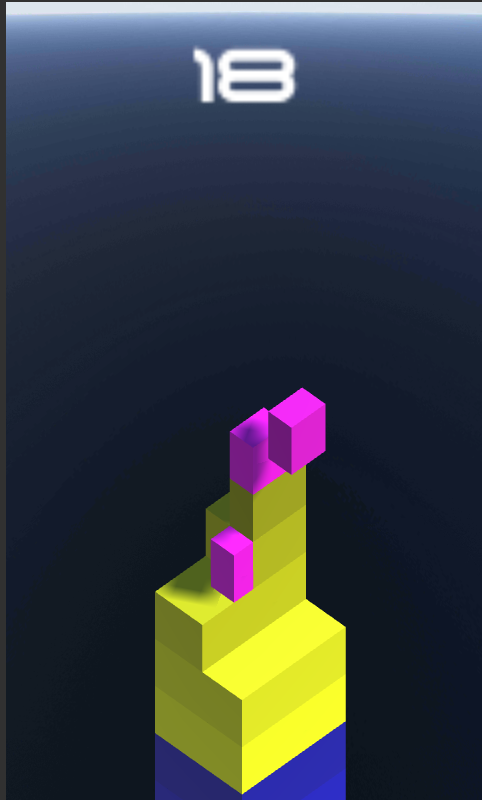
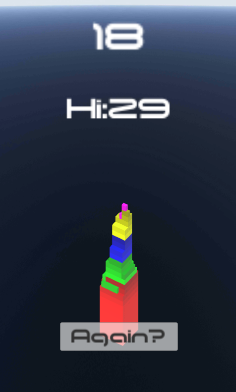

# stack
This is a simple clone of the well known "Stack" game on Android.

I developed this with the sole purpose of learning some Unity coding.

It's a pretty basic implementation, but the code is all here for anyone else to reference.

Play it here [Android App store](https://play.google.com/store/apps/details?id=com.Telecoda.Stack)

## Menu

## Playing

## Game over

# References
- **Font:** nimavisual-moonhouse [http://www.fontspace.com/nimavisual/moonhouse](http://www.fontspace.com/nimavisual/moonhouse)
- **Skybox:** [https://www.assetstore.unity3d.com/en/#!/publisher/4555](https://www.assetstore.unity3d.com/en/#!/publisher/4555)
- **Video:** [Making Android Stack Game](https://www.youtube.com/watch?v=I19cC_HcyC0) This video was a good reference for getting started.
